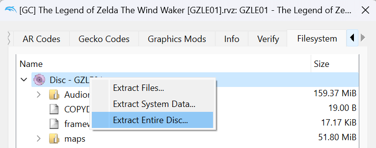
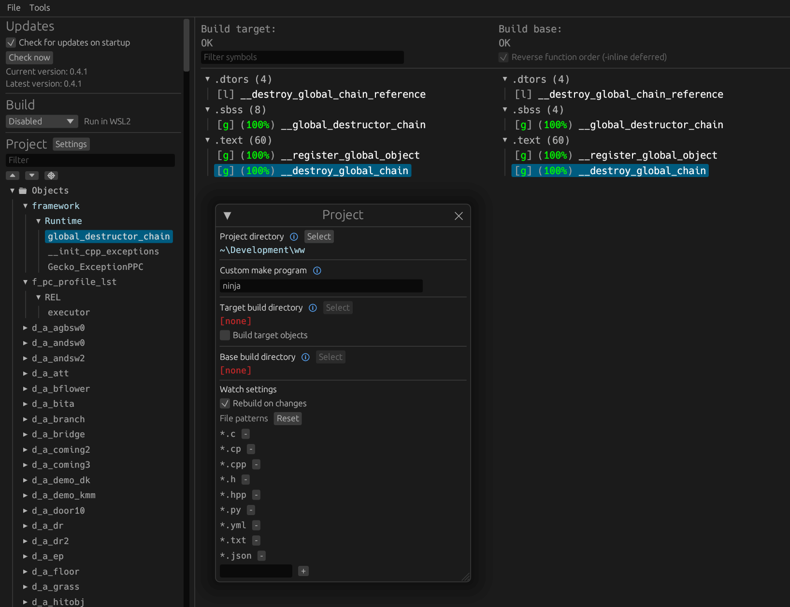

Star Fox Adventures
<!-- [![Build Status]][actions] ![Progress] [![Discord Badge]][discord] -->
=============

<!--
Replace with your repository's URL.
-->
[Build Status]: https://github.com/zeldaret/tww/actions/workflows/build.yml/badge.svg
[actions]: https://github.com/zeldaret/tww/actions/workflows/build.yml
<!---
Code progress URL:
https://progress.decomp.club/data/[project]/[version]/all/?mode=shield&measure=code
URL encoded then appended to: https://img.shields.io/endpoint?label=Code&url=
-->
<!-- [Progress]: https://img.shields.io/endpoint?label=Code&url=https%3A%2F%2Fprogress.decomp.club%2Fdata%2Ftww%2FGZLE01%2Fall%2F%3Fmode%3Dshield%26measure%3Dcode -->
<!--
Replace with your Discord server's ID and invite URL.
-->
<!-- [Discord Badge]: https://img.shields.io/discord/727908905392275526?color=%237289DA&logo=discord&logoColor=%23FFFFFF
[discord]: https://discord.gg/hKx3FJJgrV -->

A work-in-progress decompilation of Star Fox Adventures.

This repository does **not** contain any game assets or assembly whatsoever. An existing copy of the game is required.

The SDK code is from https://github.com/doldecomp/dolsdk2001 which is also decompiled.

Supported versions:

- `GSAP01`: Debug version "default.dol"

default.dol
===========

This is a debug build of the game from shortly after the initial transition to GameCube (late 2001). This file is found on the (TODO: which one?) GameCube demo disc, where it's unused and presumably included by mistake.

I'm targeting this build because:
- it has a lot of debugging functions/info that aren't present in retail builds (helps with identifying and reverse engineering)
- it has a lot of functions relating to content that was removed from later builds (for historical curiosity)
- it's compiled with minimial optimizations (makes decompiling easier)
- it does not currently work (see below); decompiling will make it easier to restore
- it can hopefully make a good starting point for other versions
- this game inherits a lot of code from Diddy Kong Racing, Jet Force Gemini, and Mickey's Speedway USA (may give helpful insights for their decomp projects)

This build doesn't boot on console or emulator because:
- it's built for some type of internal emulator Nintendo would have used as a debug tool
  - it writes to invalid addresses seemingly for debug tracing
  - it expects an RGBA framebuffer at a fixed address
  - its crash handler includes the title "Windows Protection Fault"
- it's missing its assets, and isn't compatible with those of any available version

NOTE: splits are currently very approximate guesses

Dependencies
============

Windows
--------

On Windows, it's **highly recommended** to use native tooling. WSL or msys2 are **not** required.
When running under WSL, [objdiff](#diffing) is unable to get filesystem notifications for automatic rebuilds.

- Install [Python](https://www.python.org/downloads/) and add it to `%PATH%`.
  - Also available from the [Windows Store](https://apps.microsoft.com/store/detail/python-311/9NRWMJP3717K).
- Download [ninja](https://github.com/ninja-build/ninja/releases) and add it to `%PATH%`.
  - Quick install via pip: `pip install ninja`

macOS
------

- Install [ninja](https://github.com/ninja-build/ninja/wiki/Pre-built-Ninja-packages):

  ```sh
  brew install ninja
  ```

- Install [wine-crossover](https://github.com/Gcenx/homebrew-wine):

  ```sh
  brew install --cask --no-quarantine gcenx/wine/wine-crossover
  ```

After OS upgrades, if macOS complains about `Wine Crossover.app` being unverified, you can unquarantine it using:

```sh
sudo xattr -rd com.apple.quarantine '/Applications/Wine Crossover.app'
```

Linux
------

- Install [ninja](https://github.com/ninja-build/ninja/wiki/Pre-built-Ninja-packages).
- For non-x86(_64) platforms: Install wine from your package manager.
  - For x86(_64), [wibo](https://github.com/decompals/wibo), a minimal 32-bit Windows binary wrapper, will be automatically downloaded and used.

Building
========

- Clone the repository:

  ```sh
  git clone https://github.com/my/repo.git
  ```

- Using [Dolphin Emulator](https://dolphin-emu.org/), extract your game to `orig/GAMEID`.

  - To save space, the only necessary files are the following. Any others can be deleted.
    - `sys/main.dol`
    - `files/rels/*.rel`
- Configure:

  ```sh
  python configure.py
  ```

  To use a version other than `GAMEID` (USA), specify it with `--version`.
- Build:

  ```sh
  ninja
  ```

Visual Studio Code
==================

If desired, use the recommended Visual Studio Code settings by renaming the `.vscode.example` directory to `.vscode`.

Diffing
=======

Once the initial build succeeds, an `objdiff.json` should exist in the project root.

Download the latest release from [encounter/objdiff](https://github.com/encounter/objdiff). Under project settings, set `Project directory`. The configuration should be loaded automatically.

Select an object from the left sidebar to begin diffing. Changes to the project will rebuild automatically: changes to source files, headers, `configure.py`, `splits.txt` or `symbols.txt`.


